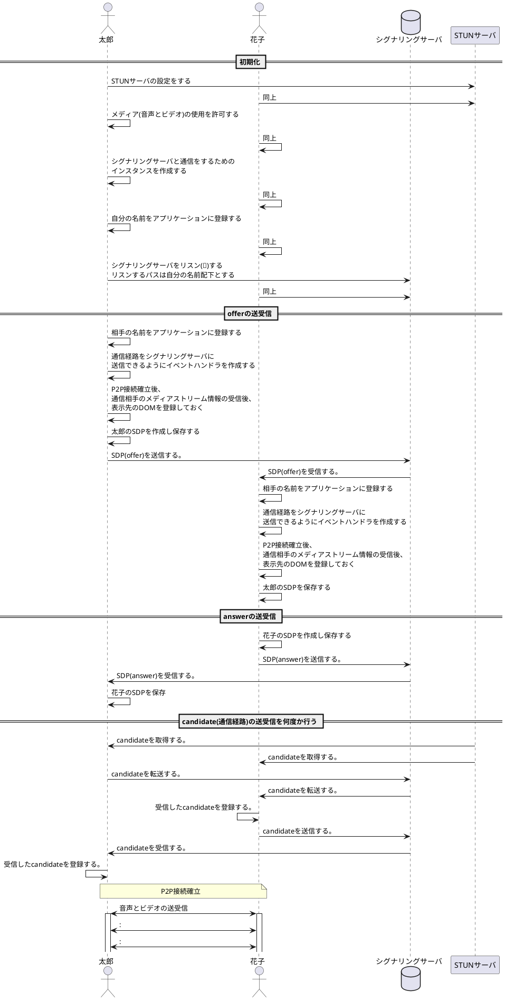

## シーケンス図

<!--
| 注釈番号 | 説明 |
| -------- |---- |
|0|STUNサーバの設定を用いてRTCPeerConnection のインスタンスを作成する。 STUNサーバとは外部の端末から接続できるようにするためのグローバルIP及びポート情報を通知してくれるサーバのこと。|
| 1 | メディアとはオーディオとビデオのこと。   MediaStream というオブジェクトが得られる。   |
| 3        | P2P 通信をする花子がシグナリングサーバにデータを書き込んだ時にイベントが発生する。そのイベントを契機に、書き込まれたデータをリアルタイムに取得するための仕掛けを行っておく。 |
| 5-1        | ここで言うイベントとは、シグナリングサーバ上のデータの書き込みのこと。 通信花子からデータの書き込みがあった時にリアルタイムにそれを読み取り、適切なアクションを取る必要がある。まだその書き込みが開始される前となるこのフェーズで、データの読み取りができるように準備を行う。  尚、ここで書き込まれるデータのタイプには、`offer`、`answer`、`candidate`の 3 つがある。   ここでは、`太郎`配下の領域に対する書き込みを拾うように設定する。|
| 5-2        | 5-1とほぼ同様のことをする。 唯一違うのは、`花子`配下の領域に対する書き込みを拾うように設定する点のみである。|
|6|candidateをシグナリングサーバに送信できるようにイベントハンドラを作成する|
|7|P2P通信確立後に通信花子からメディアストリーム情報を受け取ったら[`HTMLMediaElement.srcObject`](https://developer.mozilla.org/en-US/docs/Web/API/HTMLMediaElement/srcObject)に設定できるようにイベントハンドラを作成する|
|8|太郎が使用可能なコーデック情報等(SDP)を花子がリスンしているサーバに送信する。|
|9|花子が使用可能なコーデック情報等(SDP)を花子がリスンしているサーバに送信する。|
prettier-ignore -->
